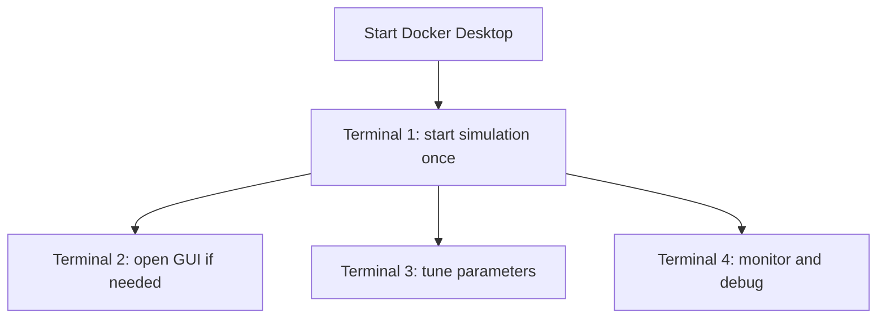

# Crazyflie Gazebo PD on WSL: Four-Terminal Operating Guide

This guide explains exactly what each terminal does when running the Crazyflie Gazebo PD demonstration with Windows, WSL 2, Docker Desktop, ROS 2 Jazzy, and Gazebo Harmonic.

## 1. Understand the three prompts

| Prompt example | Where you are | What to run there |
|---|---|---|
| `PS C:\Users\t3426>` | Windows PowerShell | `docker`, `wsl`, container lifecycle commands |
| `yujietang@TANGPC:~$` | Ubuntu under WSL | Linux and Docker commands |
| `root@docker-desktop:/workspace#` | Inside the Docker container | ROS 2, Gazebo, build and debugging commands |

If WSL says:

```text
ros2: command not found
```

enter the container first:

```bash
docker exec -it crazyflie_pd_demo bash
```

Then source ROS 2 and the workspace:

```bash
source /opt/ros/jazzy/setup.bash
source /workspace/ros2_ws/install/setup.bash
```

## 2. Startup order



Before starting, verify that the container exists:

```powershell
docker ps -a
```

If it is stopped:

```powershell
docker start crazyflie_pd_demo
```

## 3. Terminal 1 — simulation and logs

### Purpose

Terminal 1 runs the complete launch system:

- Gazebo server and physics;
- model spawning;
- ROS–Gazebo bridge;
- trajectory node;
- PD controller.

### Command

From PowerShell or WSL:

```bash
docker exec -it crazyflie_pd_demo /workspace/start_demo.sh
```

### Rules

- Run this command exactly once.
- Keep Terminal 1 open.
- Read errors and node startup messages here.
- Do not run another `start_demo.sh` or `ros2 launch` in another terminal.

Typical successful messages include:

```text
trajectory_node started
pd_controller started
ros_gz_bridge started
Entity creation successful
```

To stop the simulation cleanly, press:

```text
Ctrl+C
```

## 4. Terminal 2 — Gazebo GUI only

### Purpose

Terminal 2 opens the graphical client if the server is running but no Gazebo window appears.

### Commands

```powershell
docker exec -it crazyflie_pd_demo bash
```

Inside the container:

```bash
source /opt/ros/jazzy/setup.bash
export DISPLAY=:0
export QT_X11_NO_MITSHM=1
export LIBGL_ALWAYS_SOFTWARE=1
gz sim -g
```

### Important

`gz sim -g` starts only the GUI client. It does not replace Terminal 1.

Software rendering can increase CPU load. For a performance test, close Terminal 2 and observe the simulation through `/cf/odom` only.

The following warning is usually harmless:

```text
XDG_RUNTIME_DIR not set, defaulting to /tmp/runtime-root
```

## 5. Terminal 3 — parameter tuning

### Purpose

Terminal 3 changes PD gains or trajectory mode while the simulation is running.

### Enter and source

```powershell
docker exec -it crazyflie_pd_demo bash
```

```bash
source /opt/ros/jazzy/setup.bash
source /workspace/ros2_ws/install/setup.bash
```

### Inspect current values

```bash
ros2 param get /pd_controller kp
ros2 param get /pd_controller kd
ros2 param get /trajectory_node trajectory
ros2 param get /trajectory_node height
```

### Safe baseline

```bash
ros2 param set /pd_controller kp 2.0
ros2 param set /pd_controller kd 2.8
ros2 param set /trajectory_node trajectory circle
```

### Switch trajectory

```bash
ros2 param set /trajectory_node trajectory figure8
```

Change one gain at a time and observe the result before changing another.

## 6. Terminal 4 — monitoring and debugging

### Purpose

Terminal 4 checks the actual state, target, controller output, topic rates, nodes, and publishers.

### Enter and source

```powershell
docker exec -it crazyflie_pd_demo bash
```

```bash
source /opt/ros/jazzy/setup.bash
source /workspace/ros2_ws/install/setup.bash
```

### Check nodes and topics

```bash
ros2 node list
ros2 topic list
```

Expected core nodes:

```text
/pd_controller
/ros_gz_bridge
/trajectory_node
```

### Actual position

```bash
ros2 topic echo /cf/odom --field pose.pose.position
```

### Reference position

```bash
ros2 topic echo /cf/reference --field pose.pose.position --once
```

### One wrench sample

```bash
ros2 topic echo /cf/wrench --qos-reliability best_effort --once
```

### Publication rates

```bash
ros2 topic hz /cf/odom
ros2 topic hz /cf/reference
ros2 topic hz /cf/wrench
```

Run one rate command at a time and press `Ctrl+C` after approximately ten seconds.

### Publisher counts

```bash
ros2 topic info /cf/odom
ros2 topic info /cf/reference
ros2 topic info /cf/wrench
```

Unexpected extra publishers may indicate that the simulation was launched more than once.

## 7. Building after a source-code change

Use a separate container shell or temporarily stop the simulation first:

```bash
cd /workspace/ros2_ws
source /opt/ros/jazzy/setup.bash
python3 -m py_compile src/crazyflie_demo/crazyflie_demo/pd_controller.py
python3 -m py_compile src/crazyflie_demo/launch/demo.launch.py
colcon build --symlink-install
source install/setup.bash
```

After changing launch, world, bridge, or controller files, restart from PowerShell:

```powershell
docker restart crazyflie_pd_demo
docker exec -it crazyflie_pd_demo /workspace/start_demo.sh
```

## 8. Clean restart procedure

Use this when nodes are duplicated, the state is invalid, or the model has escaped to an extreme position.

1. Press `Ctrl+C` in Terminal 1.
2. Close the Gazebo GUI.
3. Return to PowerShell.
4. Restart the container:

```powershell
docker restart crazyflie_pd_demo
```

5. Start the demonstration once:

```powershell
docker exec -it crazyflie_pd_demo /workspace/start_demo.sh
```

Do not delete the Docker image for an ordinary simulation reset.

## 9. Quick reference

| Terminal | Main responsibility | Command that stays running |
|---|---|---|
| 1 | Physics, ROS nodes and logs | `/workspace/start_demo.sh` |
| 2 | Gazebo graphical client | `gz sim -g` |
| 3 | Gains and trajectory | No permanent command |
| 4 | State and debugging | `ros2 topic echo` or `ros2 topic hz` |

## 10. Mistakes to avoid

- Do not run `start_demo.sh` twice.
- Do not run Docker commands at `root@docker-desktop:/workspace#`.
- Do not run ROS 2 commands in WSL unless ROS 2 is installed there; use the container.
- The correct topic is `/cf/wrench`, not `/cd/wrench` or `/cf/wrencg`.
- The correct bridge file is `bridge.yaml`, not `bridge.yamlml`.
- Keep `/world/crazyflie_world/wrench`, not the persistent endpoint, for the current controller.
- After editing source code, build and restart before judging the result.

