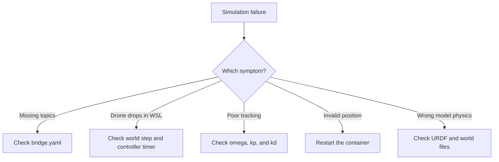

# Which File Should I Edit When the Gazebo Simulation Fails?

This guide explains which Crazyflie Gazebo PD project file to inspect when a specific part of the simulation does not work.

## 1. Correct project path

The correct source directory is:

```text
/workspace/ros2_ws/src/crazyflie_demo
```

Be careful with this spelling:

```text
serc  # incorrect
src   # correct
```

Enter the package directory:

```bash
cd /workspace/ros2_ws/src/crazyflie_demo
```

## 2. Quick file-selection table

| Problem | File to inspect or edit |
| --- | --- |
| ROS 2 and Gazebo topics are missing or not connected | `config/bridge.yaml` |
| Drone drops because the control loop is too fast for WSL | `crazyflie_demo/pd_controller.py` |
| Change `kp`, `kd`, mass, or acceleration limit | `config/controller.yaml` |
| Change circle/figure-eight path or trajectory speed | `crazyflie_demo/trajectory_node.py` |
| Change Gazebo physics rate or time step | `worlds/crazyflie_world.sdf` |
| Change drone mass, inertia, collision, or visual model | `urdf/crazyflie_description.urdf` |
| A node does not start or launch arguments are wrong | `launch/demo.launch.py` |
| Python node is not installed or executable | `setup.py` |
| Package dependency is missing | `package.xml` |

## 3. WSL drone-dropping problem

For the WSL timing problem, edit **two files**. Do not change `bridge.yaml` unless the bridge topics themselves are incorrect.

### File 1 — Gazebo physics step

```bash
nano /workspace/ros2_ws/src/crazyflie_demo/worlds/crazyflie_world.sdf
```

Change:

```xml
<max_step_size>0.001</max_step_size>
```

to:

```xml
<max_step_size>0.002</max_step_size>
```

This reduces the requested physics rate from 1000 Hz to 500 Hz, which WSL can follow more reliably.

### File 2 — PD controller timer

```bash
nano /workspace/ros2_ws/src/crazyflie_demo/crazyflie_demo/pd_controller.py
```

Change:

```python
self.timer = self.create_timer(0.001, self.control_loop)
```

to:

```python
self.timer = self.create_timer(0.002, self.control_loop)
```

The intended Gazebo physics and controller periods are now both 2 ms, or approximately 500 Hz.

## 4. When should I edit `bridge.yaml`?

```bash
nano /workspace/ros2_ws/src/crazyflie_demo/config/bridge.yaml
```

Edit this file only when ROS 2 and Gazebo are not exchanging the expected messages:

- `/cf/odom` is missing;
- `/cf/wrench` does not reach Gazebo;
- the ROS and Gazebo topic names do not match;
- a message type or bridge direction is incorrect.

Check:

```bash
ros2 topic list
ros2 topic info /cf/odom
ros2 topic info /cf/wrench
```

> `bridge.yaml` does not set Gazebo's physics step or the Python controller timer.

## 5. Controller parameters

```bash
nano /workspace/ros2_ws/src/crazyflie_demo/config/controller.yaml
```

Typical parameters include:

```yaml
kp: 2.0
kd: 2.8
mass: 0.038
max_acceleration: 3.0
```

During an experiment, change gains temporarily with:

```bash
ros2 param set /pd_controller kp 2.0
ros2 param set /pd_controller kd 2.8
```

Runtime parameter changes are temporary. Edit the YAML file if the values should remain after restarting.

## 6. Trajectory problems

```bash
nano /workspace/ros2_ws/src/crazyflie_demo/crazyflie_demo/trajectory_node.py
```

Inspect this file when:

- the circle or figure-eight equation is wrong;
- the target height or radius is wrong;
- the trajectory moves too quickly;
- you want to add an initial hovering period.

Test a slower trajectory at runtime:

```bash
ros2 param set /trajectory_node omega 0.2
ros2 param get /trajectory_node omega
```

## 7. Rebuild after editing

```bash
cd /workspace/ros2_ws
colcon build --symlink-install
source /opt/ros/jazzy/setup.bash
source install/setup.bash
```

Stop the previous simulation with `Ctrl+C` and launch it again.

If Gazebo contains an abnormal old state, restart the container:

```powershell
docker restart crazyflie_pd_demo
docker exec -it crazyflie_pd_demo /workspace/start_demo.sh
```

## 8. Verify the repair

### Check nodes

```bash
ros2 node list
```

Expected nodes include:

```text
/pd_controller
/ros_gz_bridge
/trajectory_node
```

### Check position

```bash
ros2 topic echo /cf/odom --field pose.pose.position
```

For a circle with radius `0.5 m` and target height `1.0 m`:

- `x` and `y` should remain near the circular operating area;
- `z` should remain close to `1.0 m`;
- horizontal values of tens of metres indicate an abnormal state;
- `z` near `0.015 m` indicates that the drone is on the ground.

### Check wrench frequency

```bash
ros2 topic hz /cf/wrench
```

With a `0.002 s` controller period, the intended rate is approximately 500 Hz. When the GUI uses software rendering in WSL, the measured rate may be lower. Also inspect the minimum, maximum, and standard deviation for timing jitter.

## 9. Fast decision process



## 10. Recommended debugging order

1. Check whether the expected ROS 2 nodes exist.
2. Check whether `/cf/odom` and `/cf/wrench` exist.
3. Observe the drone position.
4. Measure the wrench frequency.
5. Identify the responsible file using the table.
6. Change only one item at a time.
7. Rebuild and restart the simulation.
8. Compare the new measurements with the previous result.

This process separates communication, controller, trajectory, physics, and model problems so that students do not edit unrelated files.
