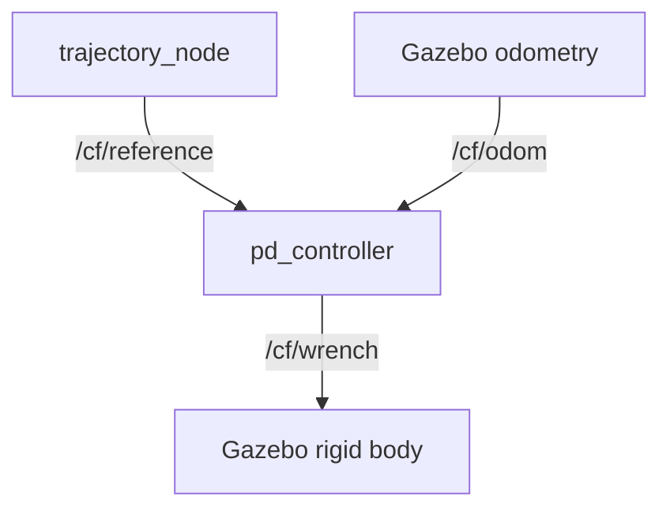

# Crazyflie Gazebo PD Controller Demo

A beginner-friendly robotics tutorial using **ROS 2 Jazzy**, **Gazebo Harmonic**, **Docker Desktop / WSL 2**, a Crazyflie model, and a simple Python PD controller.

The drone follows either a **circle** or a **figure-eight** trajectory. Students can change `kp` and `kd` while the simulation is running and immediately observe the result.

> [!NOTE]
> This is a teaching model, not a high-fidelity flight controller. It applies a simplified net force to the drone body. It intentionally excludes PID control, motor mixing, firmware SITL, and detailed rotor aerodynamics.

## Learning goals

Students will learn how to:

- install WSL 2 and connect Docker Desktop to Ubuntu;
- run a prepared Docker image;
- inspect ROS 2 nodes, topics, and odometry;
- understand the PD law `u = kp × position_error + kd × velocity_error`;
- tune `kp` and `kd` while the simulation is running;
- switch between circle and figure-eight reference paths;
- use ROS 2 commands to debug a running robotics system.

## System overview



At each control step:

```text
position_error = desired_position - current_position
velocity_error = desired_velocity - current_velocity
command        = kp × position_error + kd × velocity_error
```

The controller limits the command before publishing it. This prevents unrealistically large forces from being applied to the model.

## Repository structure

```text
crazyflie-gazebo-pd-demo/
├── README.md
├── Dockerfile
├── compose.yaml
├── start_demo.sh
├── docs/
│   ├── 01_BUILD_THE_DEMO.md
│   ├── 02_STUDENT_TUTORIAL.md
│   └── ROS2_NODE_LIST_EMPTY_DOCKER_FIX.md
└── ros2_ws/src/crazyflie_demo/
    ├── package.xml
    ├── setup.py
    ├── setup.cfg
    ├── resource/crazyflie_demo
    ├── crazyflie_demo/
    │   ├── __init__.py
    │   ├── trajectory_node.py
    │   └── pd_controller.py
    ├── urdf/crazyflie.urdf.xacro
    ├── worlds/demo_world.sdf
    ├── config/
    │   ├── controller.yaml
    │   └── bridge.yaml
    └── launch/demo.launch.py
```

## Student quick start: Windows + WSL 2

### 1. Install WSL 2 and Ubuntu

Open **PowerShell as Administrator** and run:

```powershell
wsl --install
```

Restart Windows if requested. Open Ubuntu from the Windows Start menu and create your Linux username and password.

Check that Ubuntu uses WSL 2:

```powershell
wsl -l -v
```

The Ubuntu entry should show `VERSION 2`.

### 2. Install and configure Docker Desktop

1. Install Docker Desktop for Windows.
2. Open **Docker Desktop → Settings → General**.
3. Enable **Use the WSL 2 based engine** if the option is shown.
4. Open **Settings → Resources → WSL Integration**.
5. Enable Ubuntu and select **Apply & restart**.

Open WSL and test the connection:

```bash
docker version
docker run --rm hello-world
```

> [!IMPORTANT]
> Do not install a second Docker Engine inside Ubuntu. Docker Desktop already provides the Docker engine to WSL.

### 3. Pull the prepared image

From the WSL prompt, run:

```bash
docker pull yujietang/crazyflie-gazebo-pd:latest
```

The image only needs to be downloaded once.

## Run the experiment with four terminals

All four terminals connect to the same container named `crazyflie_pd_demo`.

### Terminal 1 — Run Docker and the main simulation

**Purpose:** Start the container, Gazebo server, ROS 2 nodes, trajectory generator, and PD controller.

From the WSL prompt, run:

```bash
docker run --rm -it \
  --name crazyflie_pd_demo \
  --network host \
  --gpus all \
  -e DISPLAY=$DISPLAY \
  -e LIBGL_ALWAYS_SOFTWARE=1 \
  -v /tmp/.X11-unix:/tmp/.X11-unix:rw \
  yujietang/crazyflie-gazebo-pd:latest
```

Keep this terminal open. Pressing `Ctrl+C` here stops the main simulation.

### Terminal 2 — Open the Gazebo window

**Purpose:** Display the Crazyflie simulation.

Open another WSL terminal and enter the running container:

```bash
docker exec -it crazyflie_pd_demo bash
```

After the prompt changes to `root@docker-desktop:/workspace#`, run:

```bash
source /opt/ros/jazzy/setup.bash
export QT_X11_NO_MITSHM=1
export LIBGL_ALWAYS_SOFTWARE=1
gz sim -g
```

> [!IMPORTANT]
> Run these commands inside the container, not at the WSL prompt.

### Terminal 3 — Tune the controller and change trajectory

**Purpose:** Change `kp`, `kd`, and the reference path while the simulation continues.

Open another WSL terminal:

```bash
docker exec -it crazyflie_pd_demo bash
```

Inside the container, run:

```bash
source /opt/ros/jazzy/setup.bash
```

Set the PD gains:

```bash
ros2 param set /pd_controller kp 2.0
ros2 param set /pd_controller kd 2.8
```

Select a trajectory:

```bash
ros2 param set /trajectory_node trajectory circle
ros2 param set /trajectory_node trajectory figure8
```

Only run the command for the trajectory you want. A successful change returns:

```text
Set parameter successful
```

Check the current settings:

```bash
ros2 param get /pd_controller kp
ros2 param get /pd_controller kd
ros2 param get /trajectory_node trajectory
```

### Terminal 4 — Debug the simulation

**Purpose:** Inspect ROS 2 nodes, topics, drone position, and controller output.

Open another WSL terminal:

```bash
docker exec -it crazyflie_pd_demo bash
```

Inside the container, run:

```bash
source /opt/ros/jazzy/setup.bash
```

Run any of the following commands:

```bash
ros2 node list
ros2 topic list
ros2 topic echo /cf/odom --field pose.pose.position
ros2 topic echo /cf/wrench --once
```

Press `Ctrl+C` to stop a continuously running `ros2 topic echo` command.

## Recommended experiment

1. Start with `kp = 2.0` and `kd = 2.8`.
2. Observe the circle trajectory.
3. Increase `kp` slightly and observe tracking speed and oscillation.
4. Increase `kd` slightly and observe the damping effect.
5. Switch to the figure-eight trajectory.
6. Compare the tracking behavior with the circle.

Change one parameter at a time and record the result.

## Stop the experiment

Return to Terminal 1 and press `Ctrl+C`.

Because the Docker command uses `--rm`, the stopped container is removed automatically. The downloaded image remains available for the next session.

## Troubleshooting

### Container is not running

From WSL, check:

```bash
docker ps
```

If `crazyflie_pd_demo` is missing, start Terminal 1 again before using Terminals 2–4.

### `gz: command not found` or ROS setup file is missing

You are probably running the command at the WSL prompt. First enter the container:

```bash
docker exec -it crazyflie_pd_demo bash
```

Then run the ROS 2 or Gazebo command.

### Gazebo shows an `XDG_RUNTIME_DIR` warning

The following message is usually harmless if the Gazebo window opens:

```text
QStandardPaths: XDG_RUNTIME_DIR not set, defaulting to '/tmp/runtime-root'
```

### ROS 2 node list is empty

See [ROS 2 node list is empty in Docker](docs/ROS2_NODE_LIST_EMPTY_DOCKER_FIX.md).

## Documentation

| Reader | Document | Purpose |
| --- | --- | --- |
| Instructor / developer | [Build the demo](docs/01_BUILD_THE_DEMO.md) | Create the ROS package, controller, launch file, Docker image, and publish the image. |
| Student | [Student tutorial](docs/02_STUDENT_TUTORIAL.md) | Install WSL/Docker Desktop, pull the image, run the demo, and tune PD gains. |
| Everyone | [Crazyswarm2](https://github.com/IMRCLab/crazyswarm2) | Upstream Crazyflie description and attribution. |
| Everyone | [ROS 2 Jazzy documentation](https://docs.ros.org/en/jazzy/) | ROS 2 concepts and commands. |
| Everyone | [Gazebo Harmonic–ROS 2 integration](https://gazebosim.org/docs/harmonic/ros2_integration/) | Gazebo Transport and ROS topic bridging. |
| Windows users | [Install WSL](https://learn.microsoft.com/windows/wsl/install) | Official WSL installation guide. |
| Windows users | [Docker Desktop WSL integration](https://docs.docker.com/desktop/features/wsl/) | Enable Docker inside Ubuntu/WSL. |

## Scope and limitations

This project demonstrates the software flow between a trajectory generator, a PD controller, ROS 2 topics, and a simulated rigid body. It is suitable for learning and controller-tuning experiments, but it should not be treated as a validated controller for a physical Crazyflie.
